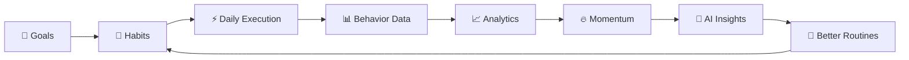
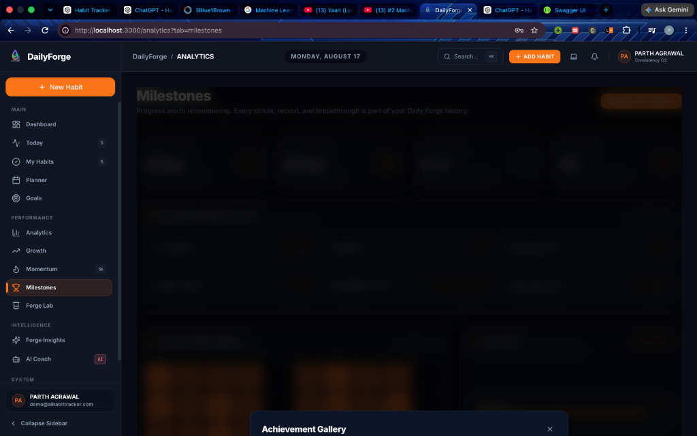
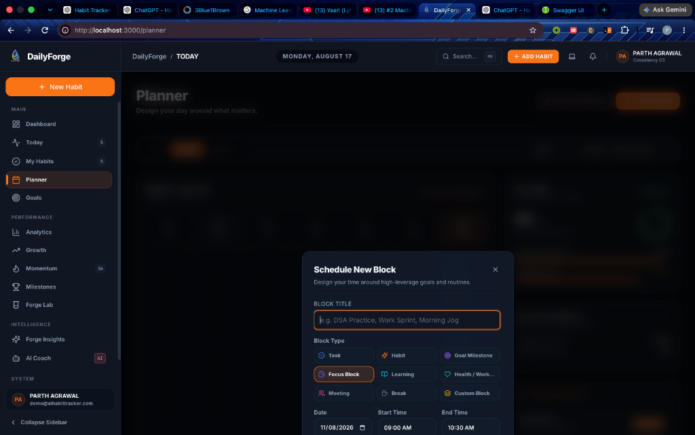
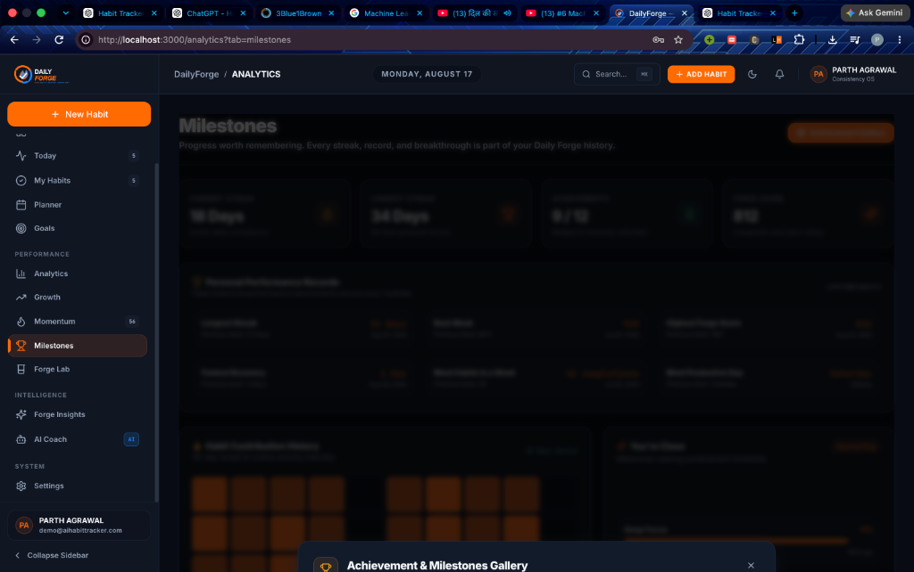
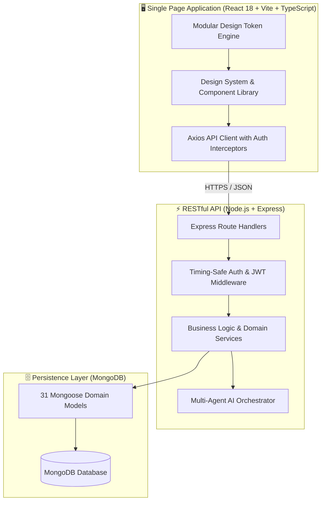
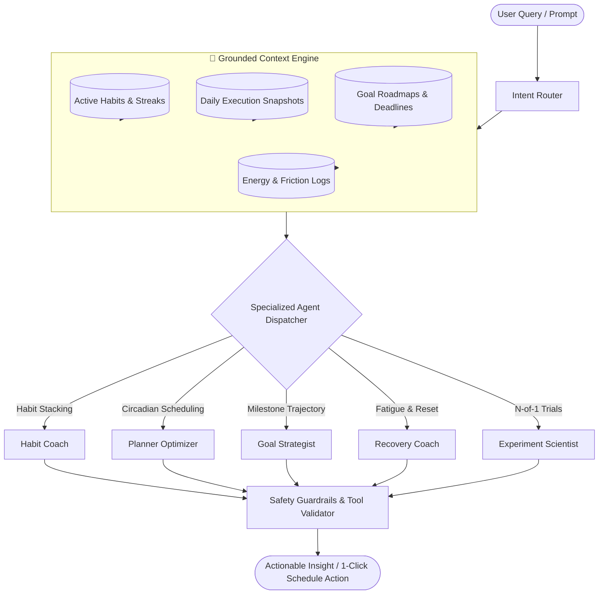

<p align="center">
  
</p>

<h1 align="center">🔥 Daily Forge</h1>

<p align="center">
  <strong>Build Better. Every Day.</strong>
</p>

<p align="center">
  A high-performance personal operating system engineered to transform ambitious goals into consistent daily execution through atomic habits, time-blocked planning, transparent behavioral analytics, scientific N-of-1 experimentation, and grounded multi-agent AI intelligence.
</p>

<p align="center">
  <a href="https://react.dev/"></a>
  <a href="https://www.typescriptlang.org/"></a>
  <a href="https://tailwindcss.com/"></a>
  <a href="https://nodejs.org/"></a>
  <a href="https://expressjs.com/"></a>
  <a href="https://www.mongodb.com/"></a>
  <a href="https://jestjs.io/"></a>
  <a href="https://vitejs.dev/"></a>
  <a href="./LICENSE"></a>
</p>

<p align="center">
  <a href="#-getting-started"><strong>[ 💻 Run Locally ]</strong></a> &nbsp;•&nbsp;
  <a href="./docs/README.md"><strong>[ 📚 Documentation Hub ]</strong></a> &nbsp;•&nbsp;
  <a href="#-api-documentation"><strong>[ 🔵 Swagger API ]</strong></a> &nbsp;•&nbsp;
  <a href="./docs/ai/README.md"><strong>[ 🤖 AI Architecture ]</strong></a> &nbsp;•&nbsp;
  <a href="./docs/architecture/system.md"><strong>[ 🏗 System Design ]</strong></a>
</p>

---

## 📌 Table of Contents

- [🔥 What is Daily Forge?](#-what-is-daily-forge)
- [⚒️ The Forge Philosophy](#️-the-forge-philosophy)
- [✨ Core Capabilities](#-core-capabilities)
- [🖥️ Product Tour](#️-product-tour)
- [🏗️ System Architecture](#️-system-architecture)
- [🤖 Grounded AI Architecture](#-grounded-ai-architecture)
- [🔌 API Documentation](#-api-documentation)
- [🗄️ Data Architecture](#️-data-architecture)
- [🛠️ Technology Stack](#️-technology-stack)
- [⚙️ Getting Started](#️-getting-started)
- [🧪 Testing & Verification](#-testing--verification)
- [🎨 Design System & Theme Studio](#-design-system--theme-studio)
- [🗺️ Roadmap](#️-roadmap)
- [🔐 Security Policy](#-security-policy)
- [🤝 Contributing](#-contributing)
- [📄 License](#-license)

---

## 🔥 What is Daily Forge?

**Daily Forge is NOT another simplistic checkbox habit tracker.**

Most productivity tools treat routines as isolated binary tasks without understanding human capacity, circadian rhythms, or long-term ambition roadmaps. When users miss a day, generic apps punish them with broken streaks and negative feedback loops.

**Daily Forge redefines habit tracking as a Personal Operating System:**
1. **Directional Roadmaps**: Decompose long-term multi-month goals into weighted milestones and recurring atomic habits.
2. **Circadian Time-Blocking**: Match cognitive task difficulty with biological energy peaks (morning deep work vs evening reflection).
3. **Transparent Behavioral Telemetry**: Track execution velocity, recovery rates, and a deterministic 5-pillar **Forge Score** (0–1000).
4. **N-of-1 Scientific Trials**: Use **Forge Lab** to test behavioral interventions with hypothesis-driven trial schedules.
5. **Grounded Multi-Agent AI**: A fleet of specialized assistants (Habit Coach, Planner Optimizer, Momentum Analyst) that ground advice in your authentic historical telemetry.

---

## ⚒️ The Forge Philosophy

> *"Goals define your direction. Habits construct your systems. Daily execution builds your evidence. Consistency compounds into mastery."*



---

## ✨ Core Capabilities

| Capability | Module | Description | Status |
|---|---|---|:---:|
| **Atomic Habit Engine** | `Habits` | Binary, numeric, duration, and checklist routines with circadian time windows and friction logs. | ✅ Complete |
| **High-Impact Goals** | `Goals` | Multi-tier goal trees with milestone weights, deadline trajectories, and linked habits. | ✅ Complete |
| **Circadian Planner** | `Planner` | 24-hour visual time-blocking calendar with AI auto-schedule and focus session tracking. | ✅ Complete |
| **End of Day Review** | `Today` | Idempotent daily reflection cockpit capturing completion rates, focus time, and mood. | ✅ Complete |
| **Forge Score Engine** | `Analytics` | 5-pillar mathematical score (Consistency, Execution, Reliability, Momentum, Recovery). | ✅ Complete |
| **Forge Lab Experiments**| `Forge Lab` | 4-step scientific N-of-1 trial builder to test routine optimizations (7–30 days). | ✅ Complete |
| **Digital Collectibles** | `Milestones` | Rarity-tiered milestone medallions (Bronze $\rightarrow$ Legendary) with profile showcase pinning. | ✅ Complete |
| **Grounded AI Multi-Agent** | `AI Coach` | Autonomous intent-routed agent fleet powered by personal telemetry context. | ✅ Complete |
| **Theme Studio** | `Settings` | Modular design-token studio with 10 presets, custom HEX picker, and schema export/import. | ✅ Complete |

---

## 🖥️ Product Tour

<p align="center">
  
  <br />
  <em>End of Day Momentum Review Cockpit — Capturing execution metrics, focus time, and subjective reflections.</em>
</p>

<p align="center">
  
  <br />
  <em>High-Impact Goal Studio — Milestone roadmap decomposition with trajectory pacing curves.</em>
</p>

<p align="center">
  
  <br />
  <em>DailyForge Theme Studio — Interactive live preview cockpit with 10 curated color profiles & token controls.</em>
</p>

---

## 🏗️ System Architecture

DailyForge follows a clean, decoupled layered service architecture:



---

## 🤖 Grounded AI Architecture

Unlike generic chat wrappers, DailyForge connects AI assistants directly to your **computed behavioral telemetry**, ensuring zero hallucination and mathematically grounded coaching.



---

## 🔌 API Documentation

DailyForge provides a production-grade RESTful API. When running locally, explore interactive specifications:

- 🔵 **Interactive Swagger UI**: [`http://localhost:5001/api-docs`](http://localhost:5001/api-docs)
- 🧾 **OpenAPI JSON**: [`http://localhost:5001/api-docs.json`](http://localhost:5001/api-docs.json)

### Core Endpoints Overview

| Domain | Method | Endpoint | Description |
|---|:---:|---|---|
| **Auth** | `POST` | `/api/v1/auth/request-otp` | Request 6-digit email OTP. |
| **Auth** | `POST` | `/api/v1/auth/verify-otp` | Verify OTP and receive JWT token. |
| **Today** | `GET` | `/api/v1/today` | Retrieve today's habits, progress, and Spark quote. |
| **Today** | `POST` | `/api/v1/today/review` | Submit idempotent End of Day Review. |
| **Habits** | `GET` | `/api/v1/habits` | List active habits with streak metrics. |
| **Habits** | `POST` | `/api/v1/habits` | Create routine with circadian timing and targets. |
| **Habits** | `POST` | `/api/v1/habits/:id/complete` | Record daily habit completion. |
| **Planner**| `GET` | `/api/v1/planner` | Fetch calendar overview, capacity, and day health. |
| **Planner**| `POST` | `/api/v1/planner/events` | Schedule new time block on planner. |
| **Goals** | `GET` | `/api/v1/goals` | List high-impact goals and trajectory pacing. |
| **Goals** | `POST` | `/api/v1/goals` | Create goal with milestones and targets. |
| **Analytics**| `GET` | `/api/v1/analytics/overview` | Compute 5-pillar Forge Score and trend history. |
| **AI** | `POST` | `/api/v1/ai/coach/chat` | Query the multi-agent AI coaching fleet. |

*Full API specification available in [`docs/api/`](./docs/api/).*

---

## 🗄️ Data Architecture

```mermaid
erDiagram
    USER ||--o{ HABIT : owns
    USER ||--o{ GOAL : owns
    USER ||--o{ CALENDAR_EVENT : owns
    USER ||--o{ DAILY_REVIEW : records
    USER ||--o{ DAILY_SNAPSHOT : aggregates
    USER ||--o{ USER_ACHIEVEMENT : earns

    HABIT ||--o{ HABIT_COMPLETION : tracks
    HABIT ||--o{ HABIT_MISS : logs
    GOAL ||--o{ MILESTONE : decomposes
    GOAL ||--o{ HABIT : connects
    ACHIEVEMENT ||--o{ USER_ACHIEVEMENT : unlocks

    USER {
        ObjectId _id PK
        string email UK
        string name
        string timezone
        boolean isVerified
    }
    HABIT {
        ObjectId _id PK
        string name
        string trackingType
        number currentStreak
        number completionRate
    }
    DAILY_REVIEW {
        ObjectId _id PK
        string date UK_compound
        string rating
        number completionPercentage
        string forgeNote
    }
    GOAL {
        ObjectId _id PK
        string name
        number progress
        string status
    }
```

---

## 🛠️ Technology Stack

```text
Frontend:         React 18 · TypeScript 5 · Tailwind CSS · Vite 5 · Lucide Icons · Recharts
Backend:          Node.js 20+ · Express.js · Mongoose ORM · JWT · Timing-Safe Crypto OTP
Database:         MongoDB 6+ (Compound Unique Indexes & Strict Schemas)
Architecture:     Grounded Personal Context Engine · Multi-Agent Fleet · Design Token Studio
Testing:          Jest · Supertest · Comprehensive Domain Integration Runner
```

---

## ⚙️ Getting Started

### Prerequisites
- **Node.js**: `v18.0.0` or higher (`v20+` recommended)
- **MongoDB**: Local MongoDB instance (`mongodb://localhost:27017`) or MongoDB Atlas URI

### 1. Clone Repository
```bash
git clone https://github.com/dailyforge/dailyforge.git
cd DailyForge
```

### 2. Configure Environment Variables
```bash
# Backend environment setup
cp backend/.env.example backend/.env
```

Ensure `backend/.env` contains your configuration:
```env
PORT=5001
MONGODB_URI=mongodb://localhost:27017/ai-habit-tracker
JWT_SECRET=your_super_secret_jwt_key_dailyforge_prod_2026
OTP_PEPPER_SECRET=your_cryptographic_otp_pepper_secret_key_2026
EMAIL_SERVICE=mock # or 'smtp' with Gmail App Password
```

### 3. Install & Start Backend
```bash
cd backend
npm install
npm run dev
```
*Backend runs on `http://localhost:5001` (Swagger API at `http://localhost:5001/api-docs`).*

### 4. Install & Start Frontend
```bash
cd ../frontend
npm install
npm run dev
```
*Frontend runs on `http://localhost:5173`.*

---

## 🧪 Testing & Verification

DailyForge maintains strict automated quality control across frontend and backend layers:

```bash
# Run backend Jest test suite
cd backend
npm test

# Run comprehensive 12-domain E2E integration runner
node scripts/run_e2e_verification.js

# Run frontend TypeScript type checking
cd ../frontend
npx tsc --noEmit

# Build production bundle
npm run build
```

---

## 🎨 Design System & Theme Studio

DailyForge features an integrated **Theme Studio** providing real-time workspace personalization via semantic CSS design tokens:

- 🔥 **Forge Dark**: High-contrast dark workspace with amber orange highlights.
- ☀️ **Forge Light**: Daylight workspace with deep indigo typography.
- 🔵 **Focus Blue**: Deep electric cyan tuned for coding concentration.
- 🌲 **Forest Mint**: Emerald green and midnight pine for sustainable habit building.
- ✨ **Amber Forge**: Golden hearth warmth and radiant energy.
- 🖤 **Monochrome**: Distraction-free silver, charcoal, and slate.
- 🌌 **Midnight**, ❄️ **Arctic Focus**, 🍷 **Crimson Forge**, 🌊 **Ocean Forge**.

---

## 🗺️ Roadmap

- [x] **Email OTP Authentication**: Timing-safe cryptographic HMAC-SHA256 verification.
- [x] **Universal Dialog Design System**: Master modal templates mounted via React Portals.
- [x] **End of Day Momentum Review**: Idempotent daily reflection cockpit.
- [x] **Multi-Tier Goal Roadmaps**: Checkpoint milestones and velocity curves.
- [x] **Theme Studio & Design Tokens**: 10 curated presets with live preview and JSON export/import.
- [x] **Forge Lab Behavioral Trials**: N-of-1 scientific routine experiments.
- [ ] **Mobile Native Companion**: React Native / Expo companion app.
- [ ] **Wearable & Biometric Sync**: Apple HealthKit & Google Health Connect sync.

---

## 🔐 Security Policy

Security and data isolation are core engineering priorities in DailyForge. Review our comprehensive [Security Policy](./SECURITY.md) for vulnerability reporting and cryptographic implementation standards.

---

## 🤝 Contributing

Contributions are welcomed! Please read our [Contributing Guide](./CONTRIBUTING.md) for local development workflows, coding conventions, and pull request guidelines.

---

## 📄 License

DailyForge is open-source software licensed under the [MIT License](./LICENSE).

---

<p align="center">
  <strong>🔥 DAILY FORGE</strong><br />
  <em>Build better. Every day.</em><br />
  Habits &bull; Consistency &bull; Momentum &bull; Growth &bull; Intelligence
</p>
