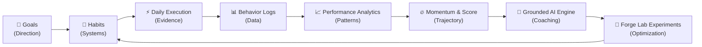
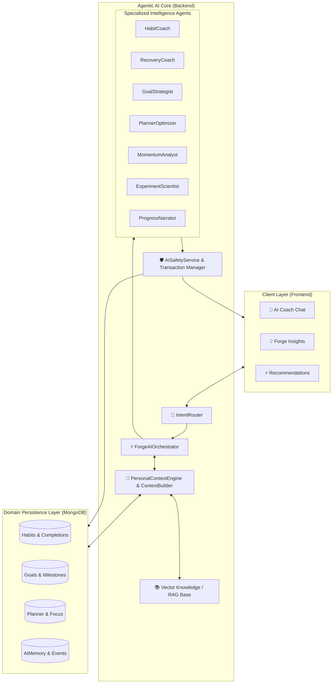

<p align="center">
  
</p>

<h1 align="center">🔥 Daily Forge</h1>

<p align="center">
  <strong>Build Better. Every Day.</strong>
</p>

<p align="center">
  <em>A high-performance personal operating system for habits, consistency, planning, goal execution, behavioral analytics, experimentation, and grounded AI coaching.</em>
</p>

<p align="center">
  <a href="#-tech-stack--architecture"></a>
  <a href="#-tech-stack--architecture"></a>
  <a href="#-tech-stack--architecture"></a>
  <a href="#-tech-stack--architecture"></a>
  <a href="#-tech-stack--architecture"></a>
  <a href="#-tech-stack--architecture"></a>
  <a href="#-api-documentation--swagger"></a>
  <a href="#-license"></a>
</p>

<p align="center">
  <a href="#-installation--getting-started"><b>💻 Run Locally</b></a> •
  <a href="#-core-capabilities--modules"><b>✨ Feature Suite</b></a> •
  <a href="#-the-forge-closed-loop-ai-engine"><b>🧠 AI Architecture</b></a> •
  <a href="#-api-documentation--swagger"><b>🔌 REST APIs</b></a> •
  <a href="#-database-domain-models"><b>🗄️ Database Models</b></a> •
  <a href="#-6-theme-visual-identity--logo-system"><b>🎨 Theme System</b></a>
</p>

---

## 📌 Table of Contents

- [🔥 What is Daily Forge?](#-what-is-daily-forge)
- [⚒️ The Forge Philosophy](#️-the-forge-philosophy)
- [✨ Core Capabilities & Modules](#-core-capabilities--modules)
- [🧠 The Forge Closed-Loop AI Engine](#-the-forge-closed-loop-ai-engine)
- [🏗️ Tech Stack & Architecture](#️-tech-stack--architecture)
- [🗂️ Project Structure](#️-project-structure)
- [🔌 API Documentation & Swagger](#-api-documentation--swagger)
- [🗄️ Database Domain Models](#️-database-domain-models)
- [🎨 6-Theme Visual Identity & Logo System](#-6-theme-visual-identity--logo-system)
- [⚙️ Installation & Getting Started](#️-installation--getting-started)
- [🧪 Testing & Verification](#-testing--verification)
- [🔐 Security, Privacy & AI Guardrails](#-security-privacy--ai-guardrails)
- [🗺️ Roadmap](#️-roadmap)
- [📄 License](#-license)

---

## 🔥 What is Daily Forge?

**Daily Forge** is not another checkbox habit tracker. It is a full-stack personal operating system designed to bridge the gap between high-level ambitions and daily behavioral execution.

Most productivity software suffers from one of two flaws: it is either a disconnected list of checkboxes that loses context over time, or a generic chatbot dispensing repetitive advice with zero memory of your actual routines. 

Daily Forge unites **atomic habit execution**, **calendar-based time blocking**, **multi-tier goal trees**, **mathematical momentum formulas**, **A/B behavioral experimentation (Forge Lab)**, and an **agentic AI coaching engine** that learns what actually works for your unique circadian rhythms and cognitive windows.

```
GOALS ➔ HABITS ➔ DAILY EXECUTION ➔ BEHAVIOR LOGS ➔ MOMENTUM & RECOVERY ➔ AI INSIGHTS ➔ COMPOUNDING GROWTH
```

---

## ⚒️ The Forge Philosophy

> *"Goals define direction. Habits build systems. Daily execution creates evidence. Analytics reveal patterns. Momentum shows trajectory. AI provides guidance. Consistency compounds."*



1. **Deterministic Grounding First**: AI never hallucinates statistics. Every metric, streak, momentum score, and recovery velocity is computed deterministically from real database logs before reaching the intelligence layer.
2. **Actionable Micro-Feedback**: Insights are linked to concrete system mutations (e.g. reschedule routine, adjust duration, launch experiment).
3. **Resilience Over Perfection**: The platform measures *Recovery Velocity*—how quickly you rebound after a missed routine—prioritizing long-term identity over fragile streaks.

---

## ✨ Core Capabilities & Modules

<table>
  <tr>
    <td width="50%">
      <h3>📊 1. Performance Overview &amp; Today</h3>
      <ul>
        <li><b>Daily Spark</b>: Dynamic contextual greeting and top priority habit.</li>
        <li><b>Forge Score (0–1000)</b>: Multi-factor composite behavioral index.</li>
        <li><b>Daily Review</b>: End-of-day reflection with energy &amp; mood logging.</li>
        <li><b>Focus Timer</b>: Pomodoro/deep focus session tracker with DB sync.</li>
      </ul>
    </td>
    <td width="50%">
      <h3>🔄 2. Habit Intelligence &amp; Management</h3>
      <ul>
        <li><b>Categorized Routines</b>: Learning, Fitness, Work, Health, Mind.</li>
        <li><b>Circadian Scheduling</b>: Morning, Afternoon, Evening, Anytime blocks.</li>
        <li><b>Difficulty &amp; Friction Tagging</b>: Identifies high-friction bottlenecks.</li>
        <li><b>Streak &amp; Freeze Protection</b>: Unbroken momentum monitoring.</li>
      </ul>
    </td>
  </tr>
  <tr>
    <td width="50%">
      <h3>🎯 3. Multi-Tier Goal Roadmap</h3>
      <ul>
        <li><b>Milestone-Weighted Progress</b>: Mathematical completion rates.</li>
        <li><b>Habit-Linked Trajectory</b>: Automatic progress from routine completions.</li>
        <li><b>Goal Velocity</b>: Velocity indicators (Ahead, On Track, Behind).</li>
        <li><b>Milestone Tree</b>: Sub-milestones with target deadlines.</li>
      </ul>
    </td>
    <td width="50%">
      <h3>📅 4. Focus Planner &amp; Time Blocking</h3>
      <ul>
        <li><b>Execution Blocks</b>: Drag &amp; drop time-blocking for routines.</li>
        <li><b>Auto-Scheduler</b>: Places habits into optimal cognitive windows.</li>
        <li><b>Capacity Forecasting</b>: Planned vs completed focus tracking.</li>
        <li><b>Daily Timeline</b>: Hourly breakdown of commitments and tasks.</li>
      </ul>
    </td>
  </tr>
  <tr>
    <td width="50%">
      <h3>🧪 5. Forge Lab (Behavioral Experiments)</h3>
      <ul>
        <li><b>Hypothesis-Driven Self-Improvement</b>: Run 7–30 day habit experiments.</li>
        <li><b>A/B Testing Routines</b>: Test morning vs evening, micro vs deep sessions.</li>
        <li><b>Automated Measurement</b>: Baseline vs active period rate comparison.</li>
        <li><b>Learning Protocol</b>: AI generates verified recommendations from outcomes.</li>
      </ul>
    </td>
    <td width="50%">
      <h3>🏆 6. Milestones &amp; Profile Center</h3>
      <ul>
        <li><b>Forge Identity Engine</b>: Deterministic titles (e.g. <i>Consistency Builder</i>).</li>
        <li><b>365-Day Activity Heatmap</b>: Interactive GitHub-style yearly contribution grid.</li>
        <li><b>Historical Benchmarks</b>: 6 all-time personal records.</li>
        <li><b>Full Data Export &amp; Privacy</b>: 1-click JSON backup and account security.</li>
      </ul>
    </td>
  </tr>
</table>

---

## 🧠 The Forge Closed-Loop AI Engine

Daily Forge incorporates an **Agentic AI Architecture** powered by a multi-agent orchestrator with contextual RAG and safety transaction guardrails.



### 8 Specialized AI Agents

| Agent | Domain & Responsibility |
|---|---|
| **`HabitCoach`** | Deep diagnostic habit analysis, friction mitigation, and circadian optimization. |
| **`RecoveryCoach`** | Rapid recovery protocols after routine misses to prevent streak collapse. |
| **`GoalStrategist`** | Milestone roadmap structuring, goal velocity tracking, and workload balancing. |
| **`PlannerOptimizer`** | Calendar conflict resolution, cognitive energy buffer management, and auto-scheduling. |
| **`MomentumAnalyst`** | Multi-week momentum trajectory synthesis and consistency trend detection. |
| **`ExperimentScientist`** | Formulates and evaluates behavioral A/B hypotheses in Forge Lab. |
| **`ProgressNarrator`** | Generates narrative weekly and monthly growth summaries with actionable takeaways. |
| **`IntentRouter`** | High-precision intent classification directing user queries to the optimal agent. |

---

## 🏗️ Tech Stack & Architecture

### Frontend
- **Framework**: [React 18](https://react.dev/) + [TypeScript 5.7](https://www.typescriptlang.org/) + [Vite 5](https://vitejs.dev/)
- **Routing**: [React Router v6](https://reactrouter.com/) (Single Page Application architecture)
- **Styling**: Vanilla CSS Semantic Tokens + [Tailwind CSS 3.4](https://tailwindcss.com/)
- **Charts & Visualization**: [Recharts 2.15](https://recharts.org/) (Area, Bar, Radar, Pie, Treemap)
- **Icons**: [Lucide React](https://lucide.dev/) (Comprehensive icon set)
- **HTTP Client**: [Axios 1.7](https://axios-http.com/) with JWT authorization interceptors

### Backend
- **Runtime**: [Node.js](https://nodejs.org/) (CommonJS modules)
- **Server Framework**: [Express 4.21](https://expressjs.com/)
- **Database & ODM**: [MongoDB](https://www.mongodb.com/) via [Mongoose 8.24](https://mongoosejs.com/)
- **Security**: [Helmet](https://helmetjs.github.io/), [bcryptjs](https://github.com/dcodeIO/bcrypt.js), [jsonwebtoken (JWT)](https://jwt.io/), [express-rate-limit](https://github.com/express-rate-limit/express-rate-limit)
- **Validation**: [Zod 3.24](https://zod.dev/) request schema validators
- **Documentation**: [Swagger UI Express](https://github.com/scottie1984/swagger-ui-express) with OpenAPI 3.0 specs
- **Testing**: [Jest 29](https://jestjs.io/) + [Supertest 7](https://github.com/ladjs/supertest)

---

## 🗂️ Project Structure

```
DailyForge/
├── backend/
│   ├── scripts/                # Database seed and reset scripts
│   ├── src/
│   │   ├── ai/                 # Agentic AI Engine
│   │   │   ├── agents/         # 8 Specialized domain agents
│   │   │   ├── context/        # ContextBuilder & PersonalContextEngine
│   │   │   ├── memory/         # Long-term AI memory services
│   │   │   ├── orchestrator/   # Multi-agent coordinator
│   │   │   ├── providers/      # OpenAI, Gemini & LocalMock abstractions
│   │   │   ├── rag/            # Vector knowledge retrieval services
│   │   │   ├── safety/         # Tool execution validation & sanitization
│   │   │   └── signals/        # Circadian & Habit risk detection
│   │   ├── config/             # Environment, Database & AI config
│   │   ├── controllers/        # Express request handlers (15 controllers)
│   │   ├── middleware/         # Auth, Rate limiting, Error & Validation middleware
│   │   ├── models/             # 30 Mongoose domain schemas
│   │   ├── routes/             # Express API v1 routers
│   │   ├── services/           # Core business logic & analytics calculators
│   │   ├── utils/              # JWT, password hashing, dates & response helpers
│   │   ├── validators/         # Zod schemas for all inbound payloads
│   │   ├── app.js              # Express app setup & middleware pipeline
│   │   └── server.js           # Server entry point & graceful shutdown
│   └── tests/                  # Integration and behavioral test suites
│
├── frontend/
│   ├── public/
│   │   └── logos/              # 12 Theme-aware SVG brand assets
│   ├── src/
│   │   ├── app/                # App entry & React Router routes
│   │   ├── components/         # Shared UI Primitives (Card, Button, Modal, etc.)
│   │   │   ├── brand/          # ThemeLogo & central logo engine
│   │   │   └── layout/         # Sidebar, TopBar, MobileNav, Shell
│   │   ├── context/            # AuthContext, ThemeContext, ToastContext
│   │   ├── features/           # Modular feature domains
│   │   │   ├── ai/             # Conversational AI Coach
│   │   │   ├── ai-insights/    # Forge Insights intelligence dashboard
│   │   │   ├── analytics/      # Performance & behavioral analytics
│   │   │   ├── auth/           # Login, Register, Protected routes
│   │   │   ├── dashboard/      # Overview, KPI cards, today checklist
│   │   │   ├── forge-lab/      # Habit experimentation suite
│   │   │   ├── goals/          # Goal trees & milestone tracking
│   │   │   ├── habits/         # Habit catalog, creation & metrics
│   │   │   ├── landing/        # SaaS landing page with live interactive preview
│   │   │   ├── milestones/     # Achievement showcase & timeline
│   │   │   ├── planner/        # Focus blocks, daily schedule & auto-planner
│   │   │   ├── profile/        # Identity, records, 365d heatmap & settings
│   │   │   └── settings/       # Theme switcher, AI preferences, notifications
│   │   ├── hooks/              # Custom React hooks (useAuth, useTheme, etc.)
│   │   ├── services/           # Frontend API client services
│   │   ├── styles/             # Design tokens & theme definitions
│   │   └── types/              # Complete TypeScript domain interfaces
│   ├── index.html              # HTML shell with theme initialization
│   ├── tailwind.config.js      # Tailwind configuration with CSS variables
│   └── vite.config.ts          # Vite configuration with path aliases
```

---

## 🔌 API Documentation & Swagger

Daily Forge exposes a fully RESTful API mounted at `/api/v1`. Interactive OpenAPI/Swagger documentation is served at `/api/docs`.

<details>
<summary><b>View Complete API Route Endpoints (Click to expand)</b></summary>

<br />

| Area | Method | Endpoint | Description |
|---|---|---|---|
| **Auth** | `POST` | `/api/v1/auth/register` | Register new user account |
| | `POST` | `/api/v1/auth/login` | Authenticate credentials & issue JWT |
| | `GET` | `/api/v1/auth/me` | Fetch authenticated session |
| **Profile** | `GET` | `/api/v1/profile` | Complete aggregated profile & identity |
| | `PATCH` | `/api/v1/profile` | Update profile, bio, handle & preferences |
| | `POST` | `/api/v1/profile/change-password` | Verified password update |
| | `GET` | `/api/v1/profile/export` | Download complete user data as JSON |
| | `DELETE` | `/api/v1/profile` | Password-confirmed account deletion |
| **Habits** | `GET` | `/api/v1/habits` | List active habits with stats |
| | `POST` | `/api/v1/habits` | Create new habit |
| | `GET` | `/api/v1/habits/:id` | Habit details with completion history |
| | `PATCH` | `/api/v1/habits/:id` | Update habit metadata |
| | `DELETE` | `/api/v1/habits/:id` | Archive habit |
| | `POST` | `/api/v1/habits/:id/complete` | Log habit completion |
| | `DELETE` | `/api/v1/habits/:id/complete` | Undo habit completion |
| **Today** | `GET` | `/api/v1/today` | Today's habits, spark & focus metrics |
| | `POST` | `/api/v1/today/review` | Submit end-of-day daily review |
| | `POST` | `/api/v1/today/focus-session` | Log completed focus timer session |
| | `GET` | `/api/v1/today/focus-sessions` | Get focus session history |
| **Goals** | `GET` | `/api/v1/goals` | List user goals with velocity |
| | `POST` | `/api/v1/goals` | Create goal with milestones |
| | `PATCH` | `/api/v1/goals/:id` | Update goal progress or status |
| | `DELETE` | `/api/v1/goals/:id` | Archive goal |
| **Planner** | `GET` | `/api/v1/planner/events` | Fetch scheduled calendar execution blocks |
| | `POST` | `/api/v1/planner/events` | Create new time block |
| | `POST` | `/api/v1/planner/auto-schedule` | Auto-schedule unscheduled habits |
| **Forge Lab** | `GET` | `/api/v1/forge-lab` | List active & completed experiments |
| | `POST` | `/api/v1/forge-lab` | Launch new habit experiment |
| | `POST` | `/api/v1/forge-lab/:id/complete` | Complete & evaluate experiment results |
| **AI Engine** | `POST` | `/api/v1/ai/chat` | Send conversational query to AI Coach |
| | `GET` | `/api/v1/ai/insights` | Fetch synthesized behavioral insights |
| | `GET` | `/api/v1/ai/recommendations` | Get personalized next-best-actions |
| | `POST` | `/api/v1/ai/recommendations/:id/accept` | Accept and execute recommendation |
| **Milestones** | `GET` | `/api/v1/milestones` | Get unlocked achievements & personal records |
| | `POST` | `/api/v1/milestones/pin` | Pin achievement to highlight reel |

</details>

---

## 🗄️ Database Domain Models

Daily Forge uses **30 specialized Mongoose domain models** ensuring strict typing, database validation, and clean separation of concerns:

- **Identity & System**: `User`, `UserAchievement`, `Achievement`, `Notification`
- **Habit Domain**: `Habit`, `HabitCompletion`, `HabitMiss`, `DailySnapshot`
- **Goal & Productivity**: `Goal`, `Task`, `CalendarEvent`, `FocusSession`, `DailyReview`, `EnergyLog`
- **Intelligence & AI**: `AICoachingProfile`, `AIConversation`, `AIMessage`, `AIMemory`, `AIMemoryEvent`, `AIInsight`, `AIRecommendation`, `AIProactiveNotification`, `AIActionTransaction`, `AIUsage`
- **Forge Lab**: `Experiment`, `ActivityEvent`, `BehaviorEvent`, `Recommendation`, `KnowledgeDocument`, `KnowledgeChunk`

---

## 🎨 6-Theme Visual Identity & Logo System

Daily Forge features a **Theme-Aware Vector Logo Engine** (`<ThemeLogo />`) synchronized with 6 official themes:

<table>
  <tr>
    <th align="center">Theme</th>
    <th align="center">Palette Accent</th>
    <th align="center">Preview Mode</th>
  </tr>
  <tr>
    <td><b>🔥 Forge Dark</b> (Default)</td>
    <td>Forge Orange (<code>#FF5722</code>) + Obsidian (<code>#0B0F19</code>)</td>
    <td>Dark High-Contrast</td>
  </tr>
  <tr>
    <td><b>☀️ Forge Light</b></td>
    <td>Warm Ember (<code>#EA580C</code>) + Clean Slate (<code>#F8FAFC</code>)</td>
    <td>Light Crisp</td>
  </tr>
  <tr>
    <td><b>🔵 Focus Blue</b></td>
    <td>Electric Cyan (<code>#0066FF</code>) + Deep Space (<code>#0A0F24</code>)</td>
    <td>Dark Neon Focus</td>
  </tr>
  <tr>
    <td><b>🌲 Forest</b></td>
    <td>Emerald Green (<code>#10B981</code>) + Pine Dark (<code>#061A14</code>)</td>
    <td>Organic Balance</td>
  </tr>
  <tr>
    <td><b>✨ Amber Forge</b></td>
    <td>Warm Gold (<code>#F59E0B</code>) + Charcoal (<code>#181512</code>)</td>
    <td>Warm Evening</td>
  </tr>
  <tr>
    <td><b>⚡ Monochrome</b></td>
    <td>Minimalist White (<code>#FFFFFF</code>) + Jet Black (<code>#09090B</code>)</td>
    <td>Pure Minimalist</td>
  </tr>
</table>

---

## ⚙️ Installation & Getting Started

### Prerequisites
- **Node.js**: v18.0.0 or higher
- **npm**: v9.0.0 or higher
- **MongoDB**: v6.0 or higher (Running locally at `mongodb://localhost:27017` or MongoDB Atlas URI)

### 1. Clone the Repository
```bash
git clone https://github.com/your-username/DailyForge.git
cd DailyForge
```

### 2. Backend Setup
```bash
cd backend

# Install dependencies
npm install

# Configure environment variables
cp .env.example .env

# (Optional) Seed demo user, habits, completions, goals and milestones
npm run seed

# Start backend development server (Default: http://localhost:5001)
npm run dev
```

### 3. Frontend Setup
```bash
cd ../frontend

# Install dependencies
npm install

# Start frontend Vite server (Default: http://localhost:5173 or 5174)
npm run dev
```

Open your browser at **`http://localhost:5173`** (or the port Vite prints in your terminal) to explore Daily Forge!

---

## 🧪 Testing & Verification

Daily Forge includes automated backend test suites covering authentication, user data isolation, behavioral metrics calculation, streak algorithms, and onboarding:

```bash
cd backend

# Run the complete test suite
npm test
```

To run TypeScript verification across the frontend:
```bash
cd frontend

# Verify 0 compilation or type errors
npx tsc --noEmit
```

---

## 🔐 Security, Privacy & AI Guardrails

- **Zero-Knowledge Deterministic Boundaries**: The AI cannot hallucinate metrics; it operates exclusively over verified database snapshots.
- **Transactional Mutation Guard**: Destructive write actions (such as habit deletion or calendar reorganization) require explicit user confirmation.
- **JWT & Password Security**: Passwords hashed with `bcryptjs` (salt rounds: 10); API endpoints protected with expiring JWT tokens.
- **Strict Data Isolation**: All database queries enforce strict `{ userId: req.user._id }` multitenancy boundaries.
- **1-Click Data Portability**: Users can export 100% of their data in structured JSON at any time from the Profile Center.

---

## 🗺️ Roadmap

- [x] **Phase 1**: Core AI Foundation, Personal Context Engine, Circadian Signal Detection.
- [x] **Phase 2**: Forge Insights, Grounded AI Coach, Multi-Agent Architecture.
- [x] **Phase 3**: Forge Lab Behavioral Experiments, Closed-Loop Learning, A/B Testing.
- [x] **Phase 4**: Theme-Aware Vector Logo Engine & 6 Named Color Themes.
- [x] **Phase 5**: Profile & Account Center with 365-Day Heatmap, Benchmarks & JSON Data Export.
- [ ] **Phase 6**: Webhooks & Apple Health / Google Fit biometrics synchronization.
- [ ] **Phase 7**: Mobile application (React Native / Expo companion).

---

## 📄 License

Distributed under the **MIT License**. See `LICENSE` for more information.

---

<p align="center">
  <sub>Forged with precision by the <b>Daily Forge</b> Team. Build better every day.</sub>
</p>
