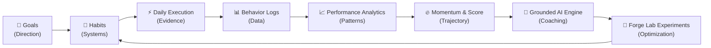
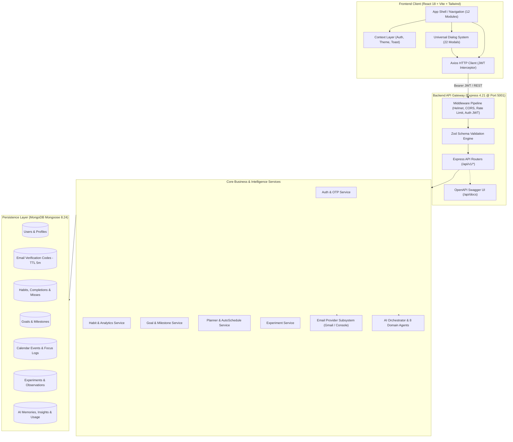
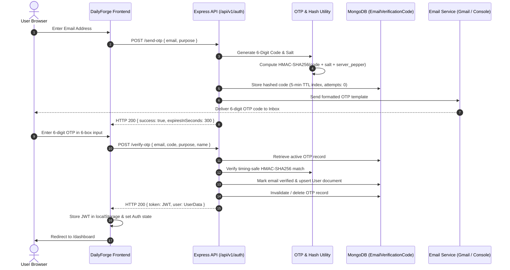
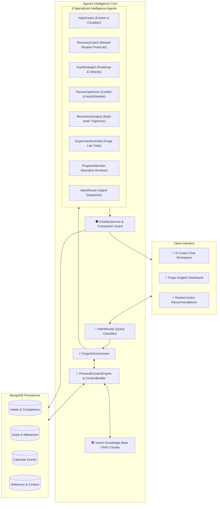
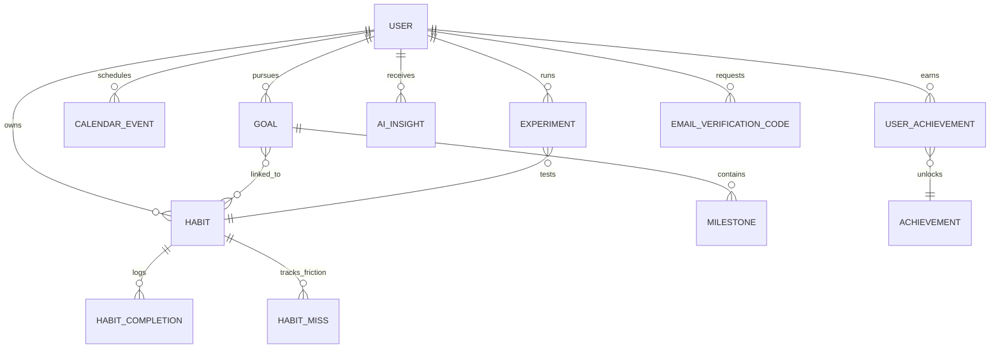

<p align="center">
  
</p>

<h1 align="center">⚒️ DailyForge</h1>

<p align="center">
  <strong>Forge Better Days. Build Lasting Consistency.</strong>
</p>

<p align="center">
  <em>An enterprise-grade personal productivity and habit operating system that bridges the gap between high-level aspirations and daily behavioral execution with mathematical momentum, circadian time-blocking, scientific routine experimentation, and grounded AI coaching.</em>
</p>

<p align="center">
  <a href="https://github.com/tensor-ops/DailyForge"></a>
  <a href="https://github.com/tensor-ops/DailyForge"></a>
  <a href="https://github.com/tensor-ops/DailyForge"></a>
  <a href="https://github.com/tensor-ops/DailyForge"></a>
  <a href="https://github.com/tensor-ops/DailyForge"></a>
  <a href="https://github.com/tensor-ops/DailyForge"></a>
  <a href="http://localhost:5001/api/docs"></a>
  <a href="https://github.com/tensor-ops/DailyForge/blob/main/LICENSE"></a>
</p>

<p align="center">
  <a href="#-quick-start--local-development"><b>💻 Quick Start</b></a> •
  <a href="#-core-feature-suite"><b>✨ Feature Suite</b></a> •
  <a href="#-system-architecture"><b>🏗️ Architecture</b></a> •
  <a href="#-email-otp-authentication"><b>🔐 OTP Auth</b></a> •
  <a href="#-rest-api-documentation--swagger"><b>🔌 REST APIs</b></a> •
  <a href="#-universal-dialog-design-system"><b>🎨 Dialog System</b></a> •
  <a href="#-database-domain-models"><b>🗄️ Database</b></a> •
  <a href="#-testing--verification"><b>🧪 Testing</b></a>
</p>

---

## 📌 Table of Contents

- [🔥 What is DailyForge?](#-what-is-dailyforge)
- [⚒️ The Forge Philosophy](#️-the-forge-philosophy)
- [✨ Core Feature Suite](#-core-feature-suite)
- [🏗️ System Architecture](#️-system-architecture)
- [🔐 Email OTP Authentication](#-email-otp-authentication)
- [🧠 The Closed-Loop AI Coaching Engine](#-the-closed-loop-ai-coaching-engine)
- [🎨 Universal Dialog Design System](#-universal-dialog-design-system)
- [🛠️ Tech Stack](#️-tech-stack)
- [🗂️ Project Structure](#️-project-structure)
- [🔌 REST API Documentation & Swagger](#-rest-api-documentation--swagger)
- [🗄️ Database Domain Models](#️-database-domain-models)
- [🎨 6-Theme Visual Identity System](#-6-theme-visual-identity-system)
- [🚀 Quick Start & Local Development](#-quick-start--local-development)
- [⚙️ Environment Variables](#️-environment-variables)
- [🧪 Testing & Verification](#-testing--verification)
- [🛡️ Security & Privacy Guardrails](#️-security-privacy--ai-guardrails)
- [🗺️ Future Roadmap](#️-roadmap)
- [🤝 Contributing](#-contributing)
- [📄 License](#-license)

---

## 🔥 What is DailyForge?

**DailyForge** is a full-stack personal operating system engineered to eliminate the gap between high-level ambitions and daily execution.

Most productivity tools suffer from two fundamental problems:
1. **Disconnected Checkboxes**: Generic task managers lack context—completing an isolated checkbox provides no insight into whether your daily routines actually advance your 90-day goals.
2. **Hallucinatory AI Assistants**: Generic chatbots dispense disconnected advice with zero grounding in your actual telemetry, sleep windows, or cognitive friction points.

DailyForge solves this with a **closed-loop behavioral architecture**:
* **Multi-Tier Goal Trees** connect to daily atomic habits.
* **Circadian Time Blocking** schedules routines into optimal cognitive windows.
* **Deterministic Analytics & Momentum Engines** compute transparent Forge Scores (0–1000) and recovery velocity.
* **Forge Lab** enables scientific N-of-1 routine experimentation (e.g. testing 7:30 PM vs 9:00 PM study windows).
* **Grounded Agentic AI Coaches** synthesize your verified execution history to deliver actionable, non-hallucinatory guidance.

```text
GOALS ➔ HABITS ➔ DAILY EXECUTION ➔ TELEMETRY LOGS ➔ FORGE SCORE ➔ N-of-1 EXPERIMENTS ➔ COMPOUNDING GROWTH
```

---

## ⚒️ The Forge Philosophy

> *"Goals provide direction. Habits build systems. Daily execution creates evidence. Analytics reveal patterns. Momentum shows trajectory. AI provides guidance. Consistency compounds."*



### Core Engineering Tenets
1. **Deterministic Grounding First**: AI never hallucinates statistics. Every metric, streak, momentum score, and recovery velocity is computed deterministically from real database logs before reaching the intelligence layer.
2. **Actionable Micro-Interventions**: Insights link directly to concrete system mutations (e.g., reschedule routine, adjust duration, launch experiment).
3. **Resilience Over Perfection**: The platform measures *Recovery Velocity*—how quickly you rebound after a missed routine—prioritizing identity resilience over fragile streaks.

---

## ✨ Core Feature Suite

| Feature Module | Key Capabilities | Technical Highlights |
|---|---|---|
| **📊 Dashboard & Today Cockpit** | Daily Spark greeting, Forge Score (0–1000), quick routine completion, cognitive energy logs, daily review modal | Real-time score recalculation, reactive state synchronization |
| **🔄 Habit Management** | Categorized habits (Health, Study, Work, etc.), flexible circadian windows, measurement types (binary, numeric, duration, checklist) | Friction tagging, streak freeze protection, Mongoose TTL logs |
| **🎯 Multi-Tier Goals** | Goal trees, milestone-weighted progress, habit-linked trajectory, velocity badges (Ahead, On Track, Behind) | Mathematical contribution formulas, dynamic milestone steppers |
| **📅 Focus Planner & Time Blocking** | 9 execution block types, drag-and-drop calendar, AI auto-scheduler, fullscreen Focus Mode countdown timer | Conflict detection, circadian capacity forecasting |
| **🧪 Forge Lab (A/B Behavior Experiments)** | N-of-1 scientific trials (7–30 days), baseline vs intervention comparison area charts, adherence scoring, 1-click schedule applying | Recharts area/line visualization, observational signal detection |
| **🏆 Milestones & Collectibles** | Digital Collectible Moments with 5 rarity tiers (`COMMON` to `LEGENDARY`), 365-day activity heatmap, achievement gallery | SVG icon medallion rendering, unlock date serialization |
| **💡 Forge Insights** | Multi-signal behavioral intelligence feed, evidence telemetry drawers, ranked recommendations with 1-click apply | Personalization coverage metric, feedback refinement loop |
| **🤖 AI Coach** | 8 specialized domain agents (HabitCoach, RecoveryCoach, GoalStrategist, etc.), multi-turn conversation memory, safety transaction manager | Contextual RAG knowledge chunks, intent routing |
| **🔐 Email OTP Authentication** | Passwordless 6-digit email OTP login and registration, HMAC-SHA256 verification, countdown resend cooldown | 5-minute MongoDB TTL index, rate limiting, Gmail REST API provider |
| **🎨 Universal Dialog System** | 22 unified modals modeled after canonical `GoalModal`, sticky footers, scrollable bodies, 100% theme awareness | Viewport-constrained (`max-h: 85vh`), zero clipped buttons |

---

## 🏗️ System Architecture

DailyForge follows an API-first, service-oriented architecture with strict separation of concerns across presentation, routing, validation, domain services, data persistence, and intelligence layers.



---

## 🔐 Email OTP Authentication

DailyForge implements a secure **passwordless Email OTP (One-Time Password)** authentication system for registration, login, and email verification.



### Security Highlights:
* **HMAC-SHA256 Hashing**: Plaintext codes are never stored in the database.
* **Automatic Expiration**: MongoDB TTL index automatically purges records after 300 seconds.
* **Brute-Force Shield**: Maximum 5 attempts allowed per code; rate-limited to 5 requests per 15 minutes per IP.
* **Multi-Provider Email Abstraction**: Seamlessly operates with `GmailEmailProvider` (via Google OAuth2 refresh tokens and Gmail REST API) in production or `ConsoleEmailProvider` during local development.

---

## 🧠 The Closed-Loop AI Coaching Engine

DailyForge features an **Agentic Multi-Agent AI Architecture** that coordinates 8 specialized domain agents with long-term memory, contextual RAG knowledge, and execution safety transaction managers.



---

## 🎨 Universal Dialog Design System

All 22 dialogs and modals across DailyForge strictly adhere to the canonical **Goal Modal Master Architecture**:

```text
┌─────────────────────────────────────────────────────────────┐
│ [ICON]  DIALOG TITLE                                    X   │
│         Helpful, contextual description                     │
├─────────────────────────────────────────────────────────────┤
│                                                             │
│                    SCROLLABLE BODY                          │
│                                                             │
│  SECTION HEADER / STEPPERS                                  │
│  ───────────────────────────────────────────────────────    │
│                                                             │
│  FIELD LABEL *                    FIELD LABEL               │
│  [________________________]       [____________________]    │
│                                                             │
│  GROUPED CARDS (e.g. Target & Milestones, Timings)          │
│  ┌───────────────────────────────────────────────────────┐  │
│  │ Field             | Field             | Field         │  │
│  └───────────────────────────────────────────────────────┘  │
│                                                             │
│  ▼ Advanced Options / AI Actions / Live Previews            │
│                                                             │
├─────────────────────────────────────────────────────────────┤
│                                Cancel  [Primary Action]     │
└─────────────────────────────────────────────────────────────┘
```

### Design Standards:
* **Viewport Containment**: Constrained to `max-height: 85vh` with pinned headers, scrollable body (`overflow-y-auto`), and pinned sticky footers. Submit buttons never disappear below the viewport.
* **Size Hierarchy**:
  * **Small (`400–500px`)**: Confirmation (`ConfirmDialog`), Habit Deletion (`DeleteHabitModal`), Focus Timer (`FocusModeModal`), Energy Check-in (`EnergyLogModal`), Profile Edit (`EditProfileModal`).
  * **Medium (`550–650px`)**: Quick Add (`QuickAddModal`), Event Scheduler (`EventModal`), Event Details (`EventDetailsModal`), Daily Review (`DailyReviewModal`), Forge Score (`ForgeScoreModal`), Collectible Reveal (`MomentDetailModal`), Command Palette (`CommandPalette` - `Cmd+K`).
  * **Large (`680–820px`)**: Goal Creator (`GoalModal`), Habit Builder (`CreateHabitModal`), Experiment Wizard (`ExperimentBuilderModal`), Experiment Detail (`ExperimentDetailModal`), Milestone Gallery (`AchievementGalleryModal`).
* **Adaptive Theme Tokens**: Clean elevated white surfaces in Light Mode; deep navy elevated surfaces in Dark Mode.

---

## 🛠️ Tech Stack

### Frontend
| Component | Technology | Version | Purpose |
|---|---|---|---|
| **Core Framework** | React | `^18.3.1` | Component-based interactive UI |
| **Language** | TypeScript | `^5.7.3` | End-to-end static type safety |
| **Build Tool** | Vite | `^5.4.14` | High-speed ESM dev server & bundler |
| **Routing** | React Router DOM | `^6.29.0` | Client-side SPA routing |
| **Styling** | Tailwind CSS | `^3.4.17` | Utility CSS with semantic design tokens |
| **Data Visualization** | Recharts | `^2.15.1` | Area, Bar, Line, Radar charts |
| **Icons** | Lucide React | `^0.475.0` | Consistent iconography |
| **HTTP Client** | Axios | `^1.7.9` | REST client with JWT interceptors |

### Backend
| Component | Technology | Version | Purpose |
|---|---|---|---|
| **Runtime** | Node.js | `>=18.0.0` | Server JavaScript runtime |
| **Web Framework** | Express | `^4.21.2` | RESTful API server & middleware pipeline |
| **Database & ODM** | MongoDB + Mongoose | `^8.24.3` | Document database and object modeling |
| **Schema Validation** | Zod | `^3.24.2` | Runtime request body validation |
| **Security & Auth** | JWT + bcryptjs + Helmet | `^9.0.2` | Token auth, password hashing, HTTP headers |
| **Rate Limiting** | express-rate-limit | `^7.5.0` | Brute force & DDoS protection |
| **API Documentation** | Swagger UI Express | `^5.0.1` | OpenAPI 3.0 interactive documentation |
| **Testing** | Jest + Supertest | `^29.7.0` | Unit & API integration test runner |

---

## 🗂️ Project Structure

```text
DailyForge/
├── backend/
│   ├── scripts/                        # Database seed and reset automation scripts
│   ├── src/
│   │   ├── ai/                         # Closed-loop AI Coaching Engine
│   │   │   ├── agents/                 # 8 Specialized domain intelligence agents
│   │   │   ├── context/                # ContextBuilder & PersonalContextEngine
│   │   │   ├── memory/                 # Long-term AI conversational memory
│   │   │   ├── orchestrator/           # IntentRouter & ForgeAIOrchestrator
│   │   │   ├── providers/              # OpenAI, Gemini & Mock provider abstractions
│   │   │   ├── rag/                    # Vector knowledge retrieval services
│   │   │   └── safety/                 # Tool execution sanitization & guardrails
│   │   ├── config/                     # Database connection & environment variables
│   │   ├── controllers/                # 15 Express request handlers
│   │   ├── middleware/                 # Auth JWT, Rate Limit, Error handling
│   │   ├── models/                     # 31 Mongoose domain schemas
│   │   ├── routes/                     # 15 API v1 router definitions
│   │   ├── services/                   # Business logic, analytics & email providers
│   │   │   └── email/                  # EmailProvider, Gmail & Console providers
│   │   ├── utils/                      # OTP generation, HMAC crypto, date helpers
│   │   ├── validators/                 # Zod validation schemas
│   │   ├── app.js                      # Express configuration & Swagger OpenAPI spec
│   │   └── server.js                   # HTTP server entrypoint & graceful shutdown
│   └── tests/                          # Jest test suites (OTP, Auth, Metrics, Streak)
│
├── frontend/
│   ├── public/
│   │   └── logos/                      # 12 Theme-aware SVG brand and logo assets
│   ├── src/
│   │   ├── app/                        # App entry and React Router routing tables
│   │   ├── components/                 # Shared UI primitives (Dialog, Button, Card)
│   │   │   ├── brand/                  # ThemeLogo & central brand engine
│   │   │   ├── dialogs/                # Master Dialog primitives & Command Palette
│   │   │   ├── layout/                 # Sidebar, TopBar, MobileNav, Shell
│   │   │   └── ui/                     # Avatar, Input, OtpInput, ProgressBar
│   │   ├── context/                    # AuthContext, ThemeContext, ToastContext
│   │   ├── features/                   # 12 Domain feature modules
│   │   │   ├── ai/                     # AI Coach chat workspace
│   │   │   ├── ai-insights/            # Forge Insights intelligence dashboard
│   │   │   ├── analytics/              # Behavioral analytics & Forge Score
│   │   │   ├── auth/                   # OTP Login, Register & verification pages
│   │   │   ├── dashboard/              # Overview, KPI cards, today execution
│   │   │   ├── forge-lab/              # Behavioral experimentation suite
│   │   │   ├── goals/                  # Goal trees & milestone roadmaps
│   │   │   ├── habits/                 # Habit builder, catalog & metrics
│   │   │   ├── milestones/             # Collectible moment cards & gallery
│   │   │   ├── planner/                # Time blocking & circadian auto-schedule
│   │   │   └── profile/                # Identity, 365d heatmap & preferences
│   │   ├── hooks/                      # Custom hooks (useAuth, useTheme, useToast)
│   │   ├── services/                   # Frontend Axios API client services
│   │   ├── styles/                     # CSS design tokens & theme variables
│   │   └── types/                      # Comprehensive TypeScript interfaces
│   ├── index.html                      # HTML shell with theme initialization
│   ├── tailwind.config.js              # Tailwind configuration with semantic tokens
│   └── vite.config.ts                  # Vite build and path alias configuration
│
└── README.md                           # Master Project Documentation
```

---

## 🔌 REST API Documentation & Swagger

DailyForge exposes an interactive OpenAPI 3.0 Swagger UI documentation dashboard:

👉 **[Open Interactive Swagger UI](http://localhost:5001/api/docs)** *(When running locally)*

### API Endpoint Directory

#### Authentication (`/api/v1/auth`)
| Method | Endpoint | Description | Auth Required |
|---|---|---|:---:|
| `POST` | `/api/v1/auth/send-otp` | Generate & dispatch 6-digit email OTP | No |
| `POST` | `/api/v1/auth/verify-otp` | Verify OTP code and issue JWT session | No |
| `POST` | `/api/v1/auth/resend-otp` | Resend active OTP with rate cooldown | No |
| `POST` | `/api/v1/auth/register` | Register with email/password (legacy) | No |
| `POST` | `/api/v1/auth/login` | Authenticate with email/password | No |
| `GET` | `/api/v1/auth/me` | Fetch authenticated user profile | Yes |

#### Habits (`/api/v1/habits`)
| Method | Endpoint | Description | Auth Required |
|---|---|---|:---:|
| `GET` | `/api/v1/habits` | List all active user habits | Yes |
| `POST` | `/api/v1/habits` | Create new habit with schedule & target | Yes |
| `GET` | `/api/v1/habits/:id` | Get detailed habit telemetry | Yes |
| `PATCH` | `/api/v1/habits/:id` | Update habit parameters | Yes |
| `DELETE` | `/api/v1/habits/:id` | Permanently delete habit | Yes |
| `POST` | `/api/v1/habits/:id/toggle` | Toggle routine completion for date | Yes |

#### Goals & Milestones (`/api/v1/goals`)
| Method | Endpoint | Description | Auth Required |
|---|---|---|:---:|
| `GET` | `/api/v1/goals` | List high-impact goals with progress | Yes |
| `POST` | `/api/v1/goals` | Create goal with target metric & milestones | Yes |
| `GET` | `/api/v1/goals/:id` | Get goal details, linked habits & tasks | Yes |
| `PATCH` | `/api/v1/goals/:id` | Update goal roadmap | Yes |
| `DELETE` | `/api/v1/goals/:id` | Delete goal | Yes |
| `POST` | `/api/v1/goals/:id/milestones` | Add checkpoint milestone | Yes |

#### Planner & Time Blocking (`/api/v1/planner`)
| Method | Endpoint | Description | Auth Required |
|---|---|---|:---:|
| `GET` | `/api/v1/planner/events` | List calendar events for date range | Yes |
| `POST` | `/api/v1/planner/events` | Schedule new time block | Yes |
| `PATCH` | `/api/v1/planner/events/:id` | Update event timing or category | Yes |
| `DELETE` | `/api/v1/planner/events/:id` | Remove block from schedule | Yes |
| `POST` | `/api/v1/planner/auto-schedule` | Generate AI Circadian auto-schedule | Yes |
| `POST` | `/api/v1/planner/auto-schedule/apply` | Apply auto-schedule adjustments | Yes |

#### Forge Lab Experiments (`/api/v1/experiments`)
| Method | Endpoint | Description | Auth Required |
|---|---|---|:---:|
| `GET` | `/api/v1/experiments` | List active and completed N-of-1 trials | Yes |
| `POST` | `/api/v1/experiments` | Launch new 7–30 day habit experiment | Yes |
| `GET` | `/api/v1/experiments/:id` | Get trial workspace, chart data & verdict | Yes |
| `POST` | `/api/v1/experiments/:id/apply` | Apply experiment outcome to habits | Yes |

#### AI Coaching & Insights (`/api/v1/ai`)
| Method | Endpoint | Description | Auth Required |
|---|---|---|:---:|
| `POST` | `/api/v1/ai/chat` | Multi-turn conversational AI Coach query | Yes |
| `GET` | `/api/v1/ai/insights/feed` | List proactive behavioral insights | Yes |
| `POST` | `/api/v1/ai/insights/:id/feedback` | Record helpful / unhelpful rating | Yes |
| `GET` | `/api/v1/ai/recommendations` | Ranked actionable routine recommendations | Yes |
| `POST` | `/api/v1/ai/recommendations/:id/apply` | Apply recommendation mutation | Yes |

---

## 🗄️ Database Domain Models

DailyForge models 31 distinct MongoDB Mongoose domain entities:



---

## 🎨 6-Theme Visual Identity System

DailyForge features a dynamic, persistent multi-theme architecture:

| Theme Name | Primary Accent | Background Surface | Identity Mood |
|---|---|---|---|
| **🔥 Forge Dark** *(Default)* | Electric Orange (`#F97316`) | Deep Navy (`#0A0F1D`) | High-focus, terminal-inspired dark mode |
| **☀️ Forge Light** | Royal Indigo (`#6366F1`) | Crisp Cloud White (`#F8FAFC`) | Clean, high-contrast daylight workspace |
| **⚡ Focus Blue** | Cyan / Cobalt (`#3B82F6`) | Dark Slate (`#0B132B`) | Deep engineering flow state |
| **🌲 Forest Mint** | Emerald Green (`#10B981`) | Midnight Pine (`#061A14`) | Calm, natural rhythm & recovery |
| **✨ Amber Forge** | Golden Amber (`#F59E0B`) | Warm Charcoal (`#181512`) | High energy, milestone celebration |
| **🖤 Monochrome** | Slate Silver (`#94A3B8`) | Jet Black (`#09090B`) | Minimalist, distraction-free execution |

---

## 🚀 Quick Start & Local Development

### Prerequisites
* **Node.js**: `>= 18.0.0`
* **npm**: `>= 9.0.0`
* **MongoDB**: Active MongoDB Atlas URI or local instance on `mongodb://localhost:27017`

### 1. Clone the Repository
```bash
git clone https://github.com/tensor-ops/DailyForge.git
cd DailyForge
```

### 2. Backend Setup
```bash
cd backend
npm install

# Configure environment
cp .env.example .env
# Edit backend/.env with your MongoDB URI & JWT Secret

# Optional: Seed sample database records
npm run seed

# Launch Backend Development Server (Port 5001)
npm run dev
```

### 3. Frontend Setup
```bash
cd ../frontend
npm install

# Launch Frontend Development Server (Port 5173)
npm run dev
```

### 4. Access the Application
* **Frontend Web App**: `http://localhost:5173`
* **Backend API Base**: `http://localhost:5001/api/v1`
* **Swagger API Docs**: `http://localhost:5001/api/docs`
* **Health Check**: `http://localhost:5001/health`

---

## ⚙️ Environment Variables

### Backend (`backend/.env`)
```env
# Server Configuration
PORT=5001
NODE_ENV=development
CLIENT_URL=http://localhost:5173

# Database
MONGODB_URI=mongodb+srv://<username>:<password>@cluster.mongodb.net/dailyforge

# Security & JWT
JWT_SECRET=your_super_secret_jwt_key_at_least_32_chars_long
JWT_EXPIRES_IN=7d

# Email Provider Configuration (Optional for production Gmail OTP)
EMAIL_PROVIDER=console
# Set to 'gmail' when using Google OAuth2
GMAIL_USER=your-email@gmail.com
GOOGLE_CLIENT_ID=your-google-client-id.apps.googleusercontent.com
GOOGLE_CLIENT_SECRET=your-google-client-secret
GOOGLE_REFRESH_TOKEN=your-google-oauth2-refresh-token

# AI Provider Configuration (Optional)
AI_PROVIDER=mock
# Set to 'openai' or 'gemini' for live AI
OPENAI_API_KEY=sk-...
GEMINI_API_KEY=AIza...
```

### Frontend (`frontend/.env`)
```env
VITE_API_URL=http://localhost:5001/api/v1
```

---

## 🧪 Testing & Verification

DailyForge includes comprehensive unit, integration, and type-safety test suites.

### Run Backend Jest Tests
```bash
cd backend
npm test
```
```text
PASS tests/otpAuth.test.js
PASS tests/behaviorMetrics.test.js
PASS tests/userIsolation.test.js
PASS tests/auth.test.js
PASS tests/onboarding.test.js
PASS tests/streak.test.js

Test Suites: 6 passed, 6 total
Tests:       23 passed, 23 total
Snapshots:   0 total
```

### Run Frontend Static Type Check
```bash
cd frontend
npx tsc --noEmit
# 0 compilation errors across all 20+ features and dialogs
```

---

## 🛡️ Security & Privacy Guardrails

* **Data Isolation**: All queries enforce tenant isolation via verified `req.user.id` extraction from signed JWT tokens.
* **Cryptographic OTP Storage**: 6-digit verification codes are hashed with HMAC-SHA256 and server-side secret salts.
* **Rate Limiting**: Critical endpoints (Auth, AI Chat, Auto-Scheduler) are protected by IP and user rate limiters.
* **Sanitized Inputs**: All inbound payloads are validated against strict Zod schemas before reaching controllers.
* **Security Headers**: Production HTTP responses are hardened with [Helmet](https://helmetjs.github.io/) headers and strict CORS policies.

---

## 🗺️ Future Roadmap

- [ ] Web Push & Cross-Platform Circadian Reminders
- [ ] Apple HealthKit & Google Fit Sleep / Activity Bi-directional Sync
- [ ] Multi-User Team & Community Accountability Pods
- [ ] Native Mobile App (React Native / Expo)
- [ ] Offline-First IndexedDB Local Sync Engine

---

## 🤝 Contributing

Contributions to DailyForge are welcome! Please follow these steps:

1. **Fork the Repository**: `https://github.com/tensor-ops/DailyForge/fork`
2. **Create a Feature Branch**: `git checkout -b feature/amazing-feature`
3. **Commit Changes**: `git commit -m 'feat: add amazing feature'`
4. **Run Verification**: Ensure `npm test` and `npx tsc --noEmit` pass with 0 errors.
5. **Push to Branch**: `git push origin feature/amazing-feature`
6. **Open a Pull Request** with a detailed summary of changes.

---

## 📄 License

Distributed under the **MIT License**. See [`LICENSE`](LICENSE) for more information.

---

<p align="center">
  Built with ⚒️ by the DailyForge Open-Source Engineering Team.
</p>

<p align="center">
  <strong>DailyForge</strong> — Forge better days. Build lasting consistency.
</p>
