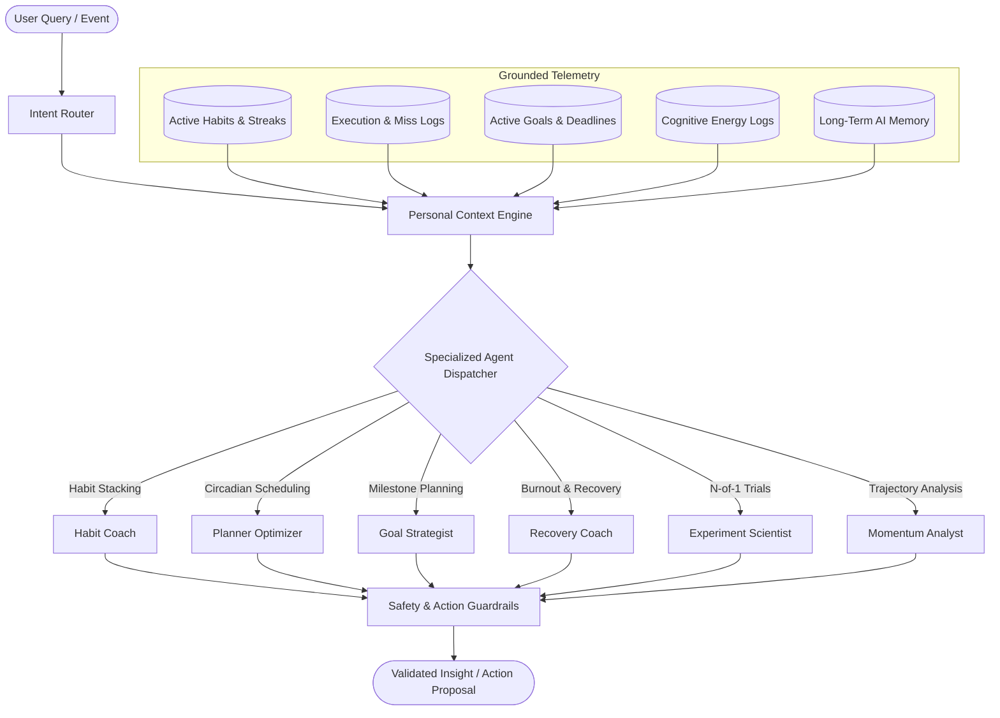

# 🤖 DailyForge AI Architecture

DailyForge implements a **Grounded Personal Context Architecture** paired with a specialized **Multi-Agent Fleet** to provide deterministic, actionable behavioral guidance without hallucination.

---

## 🏛️ AI Context Pipeline

---

## 🛡️ Key Safety Invariants

1. **Zero Hallucination Grounding**: Prompts are populated with computed metrics (Forge Score, Completion %, Sample Sizes) rather than asking LLMs to guess progress.
2. **Action Proposal Validation**: Any tool proposal (e.g. rescheduling a time block) must be validated against `AISafetyService` before presentation.
3. **Deterministic Fallbacks**: If the external AI service is unreachable, the rule-based heuristics engine handles all insights gracefully.
