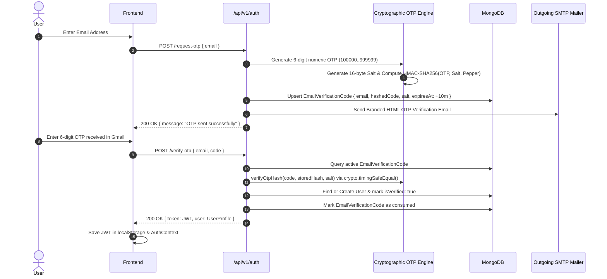

# ⚡ Backend Architecture

The DailyForge backend is a modular **Node.js + Express** REST API service designed for high throughput, strict multi-tenant isolation, and resilient behavioral intelligence.

---

## 🏛️ Layered Service Architecture

```text
HTTP Request
     ↓
Express Middleware (CORS, Helmet, Rate Limiter, Request Logger)
     ↓
Authentication Middleware (Timing-Safe HMAC-SHA256 & JWT Verification)
     ↓
Domain Controllers (Request Parsing, Input Sanitization, Response Formatting)
     ↓
Business Service Layer (HabitEngine, GoalTree, AnalyticsService, AIOrchestrator)
     ↓
Mongoose Data Layer (31 Domain Models, Compound Unique Indexes, Schema Validation)
     ↓
MongoDB Database
```

---

## 🔐 Cryptographic Authentication & Verification Flow



---

## 🛡️ Tenant Security Principles

- Every protected route is shielded by `authenticate` middleware.
- Handlers extract `req.user._id` from the decoded JWT payload.
- All MongoDB queries apply `{ userId: req.user._id }` constraints.
- Unauthenticated or cross-tenant modification requests fail immediately with `401 Unauthorized` or `403 Forbidden`.
