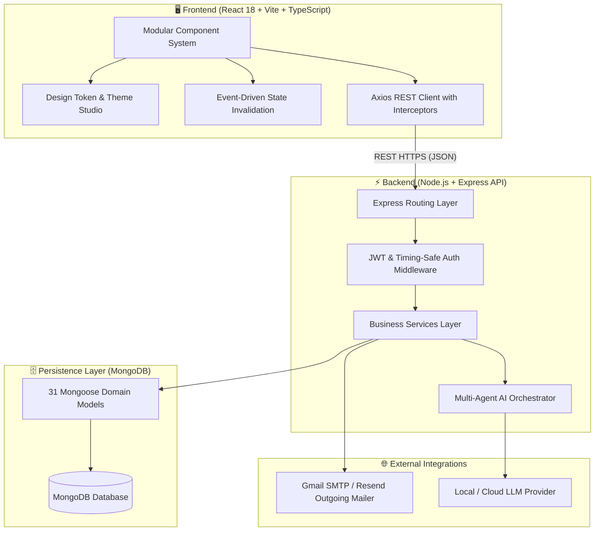
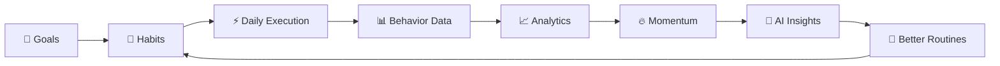

# 🏗️ System Architecture Overview

DailyForge is engineered as a modern, decoupled full-stack personal operating system designed to convert long-term ambitions into sustainable daily execution.

---

## 🏛️ End-to-End Topology

---

## 🔄 Core Behavioral Feedback Loop

---

## 🛡️ Key Architectural Invariants

1. **Strict User Tenant Isolation**: All database queries strictly filter by authenticated `req.user._id` decoded from verified JWT tokens. Client-provided user identifiers are never trusted.
2. **Deterministic Fallbacks**: All analytics, momentum calculations, and Forge Scores evaluate deterministic baseline mathematical models when AI services are unavailable or rate-limited.
3. **Idempotent Day Reviews**: `(userId, date)` composite unique indexing ensures daily reviews and snapshots can be updated without creating duplicate entries.
4. **Token-Driven UI Consistency**: 100% of UI elements derive visual properties from centralized CSS Custom Properties injected by `ThemeContext`.
